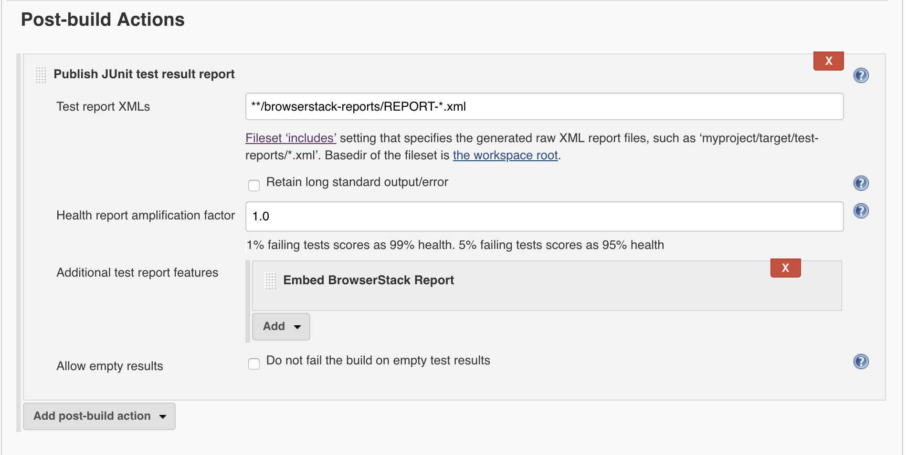

WDIO BrowserStack Reporter
===================

> A WebdriverIO plugin which enables BrowserStack reports on CI servers


## Installation

Add `wdio-browserstack-reporter` as a dependency in your `package.json`.

```json
{
  "dependencies": {
    "wdio-browserstack-reporter": "~1.0.0"
  }
}
```

## Configuration

Add `browserstack` as a reporter in your conf file.

```js
// wdio.conf.js
module.exports = {
    // ...
    reporters: ['browserstack'],
    reporterOptions: {
        browserstack: {
            outputDir: './'
        }
    },
    // ...
};
```

The following options are supported(optional):

### outputDir
Define a directory where your browserstack report files should get stored.

Type: `String`<br>

## Jenkins Setup

You will have to configure your Jenkins CI server to embed all the BrowserStack Selenium reports and logs in Jenkins.
  1. Click on Add post-build action in Post-build Actions.
  2. Click on Publish JUnit test result report
  3. In the Test report XMLs, enter */*browserstack-reports/REPORT-\*.xml
  4. In the Additional test report features section, add Embed BrowserStack Report.

This is how your configuration should look like


## Related links

[Guide to running Selenium Webdriver tests with NodeJS on BrowserStack](https://www.browserstack.com/automate/node)

[Browserstack Jenkins page](https://www.browserstack.com/automate/jenkins)

[Webdriverio](http://webdriver.io).

[Webdriverio Jenkins Integration](http://webdriver.io/guide/testrunner/jenkins.html)

[Webdriverio Junit Reporter](https://github.com/webdriverio-boneyard/wdio-junit-reporter)
